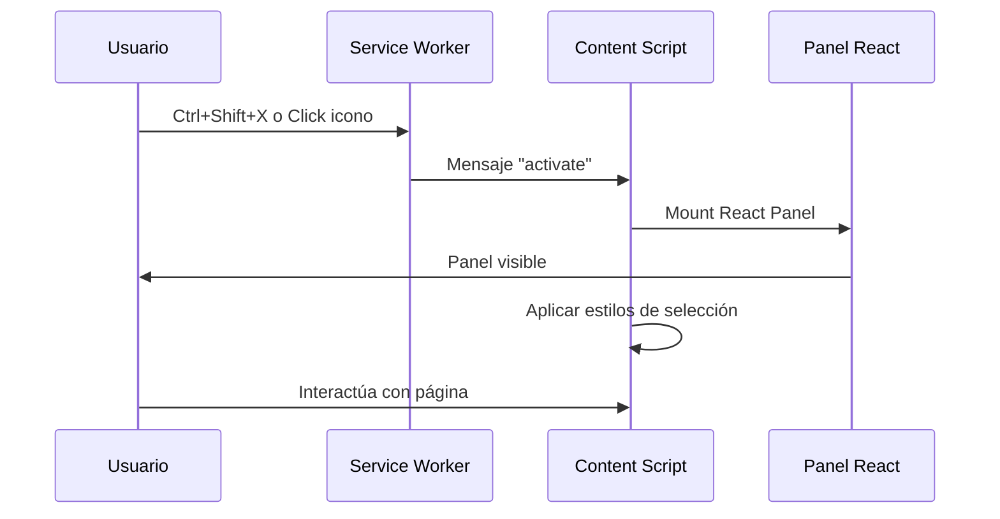
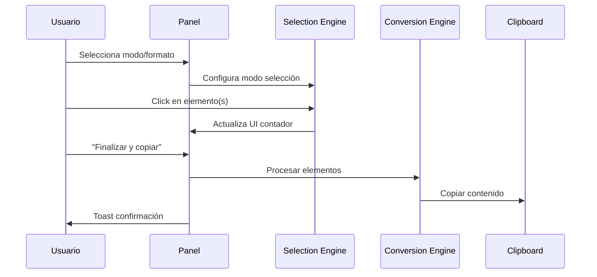

# Arquitectura Técnica - CopyVersa v2
## Chrome Extension Technical Architecture Document

### Información del Documento
- **Proyecto**: CopyVersa v2 - Chrome Extension
- **Versión**: 2.0.0
- **Arquitecto**: GitHub Copilot
- **Desarrollador**: Daniel Gómez
- **Fecha**: Mayo 29, 2025

---

## 1. Vista General de la Arquitectura

### 1.1 Diagrama de Componentes

```
┌─────────────────────────────────────────────────────────────┐
│                     Chrome Extension                        │
├─────────────────────────────────────────────────────────────┤
│                                                             │
│  ┌─────────────┐    ┌─────────────┐    ┌─────────────┐     │
│  │   Popup     │    │   Options   │    │   DevTools  │     │
│  │  (React)    │    │  (React)    │    │             │     │
│  └─────────────┘    └─────────────┘    └─────────────┘     │
│                                                             │
│  ┌─────────────────────────────────────────────────────────┐ │
│  │              Service Worker                             │ │
│  │  - Message handling                                     │ │
│  │  - Storage management                                   │ │
│  │  - Context menu creation                                │ │
│  └─────────────────────────────────────────────────────────┘ │
│                                                             │
│  ┌─────────────────────────────────────────────────────────┐ │
│  │              Content Script                             │ │
│  │  ┌─────────────┐  ┌─────────────┐  ┌─────────────┐     │ │
│  │  │   Panel     │  │  Selection  │  │ Conversion  │     │ │
│  │  │  (React)    │  │   Engine    │  │   Engine    │     │ │
│  │  └─────────────┘  └─────────────┘  └─────────────┘     │ │
│  └─────────────────────────────────────────────────────────┘ │
│                                                             │
└─────────────────────────────────────────────────────────────┘
                               │
                               ▼
                    ┌─────────────────────┐
                    │    Web Page DOM     │
                    │                     │
                    │  ┌───────────────┐  │
                    │  │   Selected    │  │
                    │  │   Elements    │  │
                    │  └───────────────┘  │
                    └─────────────────────┘
```

---

## 2. Componentes Principales

### 2.1 Service Worker (Background Script)
**Archivo**: `src/background/service-worker.ts`

**Responsabilidades:**
- Gestión de mensajes entre componentes
- Manejo de atajos de teclado globales
- Almacenamiento y recuperación de configuraciones
- Creación de context menus
- Comunicación con APIs de Chrome

**APIs utilizadas:**
```typescript
chrome.runtime.*    // Messaging
chrome.storage.*    // Persistencia
chrome.commands.*   // Atajos de teclado
chrome.contextMenus.* // Menu contextual
chrome.tabs.*       // Información de pestañas
```

### 2.2 Content Script
**Archivo**: `src/content/content-script.tsx`

**Responsabilidades:**
- Inyección del panel flotante
- Manejo de selección de elementos
- Aplicación de estilos visuales
- Conversión de contenido
- Copia al portapapeles

**Componentes React:**
```typescript
- CopyVersaPanel     // Panel principal
- ModeSelector       // Único/Múltiple
- FormatSelector     // Markdown/HTML
- QuickSettings      // Configuraciones rápidas
- SelectedCounter    // Contador de elementos
- Toast             // Notificaciones
```

### 2.3 Popup
**Archivo**: `src/popup/popup.tsx`

**Responsabilidades:**
- Estado actual de la extensión
- Acceso rápido a configuraciones
- Estadísticas de uso
- Enlaces útiles

### 2.4 Options Page
**Archivo**: `src/options/options.tsx`

**Responsabilidades:**
- Configuraciones avanzadas
- Gestión de datos del usuario
- Import/Export de configuraciones
- Gestión de temas

---

## 3. Flujo de Datos

### 3.1 Activación de la Extensión



### 3.2 Selección y Copia



---

## 4. Estado de la Aplicación

### 4.1 Estado Global (Service Worker)
```typescript
interface GlobalState {
  isActive: boolean;
  settings: CopyVersaSettings;
  stats: UsageStats;
  currentTab?: chrome.tabs.Tab;
}

interface CopyVersaSettings {
  mode: 'single' | 'multiple';
  format: 'markdown' | 'html';
  removeLinks: boolean;
  preserveSemantics: boolean;
  exitAfterCopy: boolean;
  animationDuration: number;
  theme: 'auto' | 'light' | 'dark';
}
```

### 4.2 Estado del Content Script
```typescript
interface ContentState {
  isSelecting: boolean;
  selectedElements: Element[];
  hoveredElement: Element | null;
  panelPosition: { x: number; y: number };
  settings: CopyVersaSettings;
}
```

---

## 5. Comunicación entre Componentes

### 5.1 Mensajes del Sistema
```typescript
type Message = 
  | { type: 'ACTIVATE_EXTENSION'; tabId: number }
  | { type: 'DEACTIVATE_EXTENSION' }
  | { type: 'UPDATE_SETTINGS'; settings: Partial<CopyVersaSettings> }
  | { type: 'GET_SETTINGS' }
  | { type: 'COPY_CONTENT'; elements: Element[]; format: string }
  | { type: 'SHOW_TOAST'; message: string; type: 'success' | 'error' }
  | { type: 'UPDATE_STATS'; action: string };
```

### 5.2 Event Listeners
```typescript
// Service Worker
chrome.runtime.onMessage.addListener(handleMessage);
chrome.commands.onCommand.addListener(handleCommand);
chrome.contextMenus.onClicked.addListener(handleContextMenu);

// Content Script
document.addEventListener('keydown', handleKeydown);
document.addEventListener('click', handleElementClick);
document.addEventListener('mouseover', handleElementHover);
```

---

## 6. Persistencia de Datos

### 6.1 Chrome Storage API
```typescript
// Configuraciones del usuario
chrome.storage.sync.set({
  'copyversa-settings': settings
});

// Datos temporales/cache
chrome.storage.local.set({
  'copyversa-stats': stats,
  'copyversa-cache': cache
});
```

### 6.2 Estructura de Datos
```typescript
interface StoredData {
  settings: CopyVersaSettings;
  stats: {
    totalCopies: number;
    markdownCopies: number;
    htmlCopies: number;
    lastUsed: string;
    installDate: string;
  };
  onboardingCompleted: boolean;
  panelPosition: { x: number; y: number };
}
```

---

## 7. Sistema de Conversión

### 7.1 HTML a Markdown
```typescript
import TurndownService from 'turndown';
import { gfm } from 'turndown-plugin-gfm';

class MarkdownConverter {
  private turndown: TurndownService;

  constructor(options: ConversionOptions) {
    this.turndown = new TurndownService({
      codeBlockStyle: 'fenced',
      fence: '```',
      emDelimiter: '*',
      strongDelimiter: '**',
    });
    
    this.turndown.use(gfm);
    this.applyCustomRules(options);
  }

  convert(elements: Element[]): string {
    // Conversión logic
  }
}
```

### 7.2 Limpieza de HTML
```typescript
class HtmlCleaner {
  static clean(element: Element, options: CleanOptions): string {
    const clone = element.cloneNode(true) as Element;
    
    // Remover scripts, styles, etc.
    this.removeUnwantedElements(clone);
    
    // Limpiar atributos
    this.cleanAttributes(clone, options);
    
    // Formatear
    return this.formatHtml(clone);
  }
}
```

---

## 8. Sistema de Selección

### 8.1 Selection Engine
```typescript
class SelectionEngine {
  private selectedElements: Set<Element> = new Set();
  private mode: 'single' | 'multiple' = 'single';
  
  selectElement(element: Element): void {
    if (this.mode === 'single') {
      this.clearSelection();
      this.selectedElements.add(element);
      this.copyImmediately(element);
    } else {
      this.toggleSelection(element);
    }
  }
  
  private applyVisualFeedback(element: Element): void {
    element.classList.add('cpvrsa-selected-highlight');
  }
}
```

### 8.2 Visual Feedback
```css
/* Hover state */
.cpvrsa-hover-highlight {
  outline: 2px solid #f97e4d !important;
  outline-offset: 1px !important;
}

/* Selected state */
.cpvrsa-selected-highlight {
  background: rgba(249, 126, 77, 0.2) !important;
  outline: 2px solid #f97e4d !important;
}

/* Fade out animation */
.cpvrsa-fade-out {
  animation: fadeHighlight var(--animation-duration, 12s) cubic-bezier(0.4, 0, 0.2, 1) forwards;
}

@keyframes fadeHighlight {
  0% { background: rgba(249, 126, 77, 0.2); }
  100% { background: transparent; }
}
```

---

## 9. Seguridad y Permisos

### 9.1 Manifest v3 Permissions
```json
{
  "permissions": [
    "activeTab",      // Acceso a pestaña activa solamente
    "storage",        // Persistencia de configuraciones
    "clipboardWrite"  // Escritura al portapapeles
  ],
  "host_permissions": [
    "<all_urls>"      // Necesario para content scripts
  ]
}
```

### 9.2 Content Security Policy
```json
{
  "content_security_policy": {
    "extension_pages": "script-src 'self'; object-src 'self'"
  }
}
```

### 9.3 Sanitización de Contenido
```typescript
class ContentSanitizer {
  static sanitize(content: string): string {
    // Remover scripts maliciosos
    // Validar HTML
    // Escapar caracteres peligrosos
    return cleanContent;
  }
}
```

---

## 10. Performance y Optimización

### 10.1 Lazy Loading
```typescript
// Content script se carga solo cuando es necesario
const loadCopyVersaPanel = async () => {
  if (!document.getElementById('copyversa-root')) {
    const { CopyVersaPanel } = await import('./components/CopyVersaPanel');
    // Mount component
  }
};
```

### 10.2 Memory Management
```typescript
class MemoryManager {
  static cleanup(): void {
    // Remover event listeners
    // Limpiar referencias DOM
    // Garbage collection de elementos seleccionados
  }
}
```

### 10.3 Bundle Optimization
```typescript
// vite.config.ts
export default defineConfig({
  build: {
    rollupOptions: {
      output: {
        manualChunks: {
          'turndown': ['turndown', 'turndown-plugin-gfm'],
          'react': ['react', 'react-dom']
        }
      }
    }
  }
});
```

---

## 11. Testing Strategy

### 11.1 Unit Tests
```typescript
// Selection engine tests
describe('SelectionEngine', () => {
  test('should select single element in single mode', () => {
    // Test logic
  });
});

// Conversion tests
describe('MarkdownConverter', () => {
  test('should convert table to GFM', () => {
    // Test logic
  });
});
```

### 11.2 Integration Tests
```typescript
// Content script integration
describe('Content Script Integration', () => {
  test('should inject panel correctly', () => {
    // Test logic
  });
});
```

### 11.3 E2E Tests (Playwright)
```typescript
// Extension testing
test('should copy content from Wikipedia', async ({ page }) => {
  await page.goto('https://wikipedia.org');
  // Simulate extension usage
});
```

---

## 12. Build y Deployment

### 12.1 Build Process
```bash
npm run build          # Production build
npm run build:dev      # Development build
npm run zip            # Create CRX package
```

### 12.2 Environment Variables
```typescript
// Environment configuration
const config = {
  development: {
    DEBUG: true,
    LOG_LEVEL: 'verbose'
  },
  production: {
    DEBUG: false,
    LOG_LEVEL: 'error'
  }
};
```

---

## 13. Monitoreo y Analytics

### 13.1 Error Tracking
```typescript
class ErrorTracker {
  static logError(error: Error, context: string): void {
    console.error(`[CopyVersa] ${context}:`, error);
    // En producción: enviar a servicio de logging
  }
}
```

### 13.2 Usage Analytics
```typescript
class Analytics {
  static trackAction(action: string, metadata?: any): void {
    // Privacy-first analytics
    // Solo métricas aggregadas, no contenido
  }
}
```

---

## 14. Roadmap Técnico

### 14.1 Fase 1: Arquitectura Base ✅
- Manifest v3 setup
- Build system con Vite
- Component structure

### 14.2 Fase 2: Core Functionality
- Selection engine
- Content script injection
- Basic conversion

### 14.3 Fase 3: UI/UX Polish
- React components
- Animations
- Design system

### 14.4 Fase 4: Advanced Features
- Multiple formats
- Advanced settings
- Performance optimization

### 14.5 Fase 5: Production Ready
- Testing complete
- Error handling
- Chrome Web Store submission

---

**Documento preparado por:** GitHub Copilot (Arquitecto de Software)  
**Para implementación por:** Daniel Gómez (Developer)  
**Revisión técnica:** Pendiente  
**Fecha de última actualización:** Mayo 29, 2025
